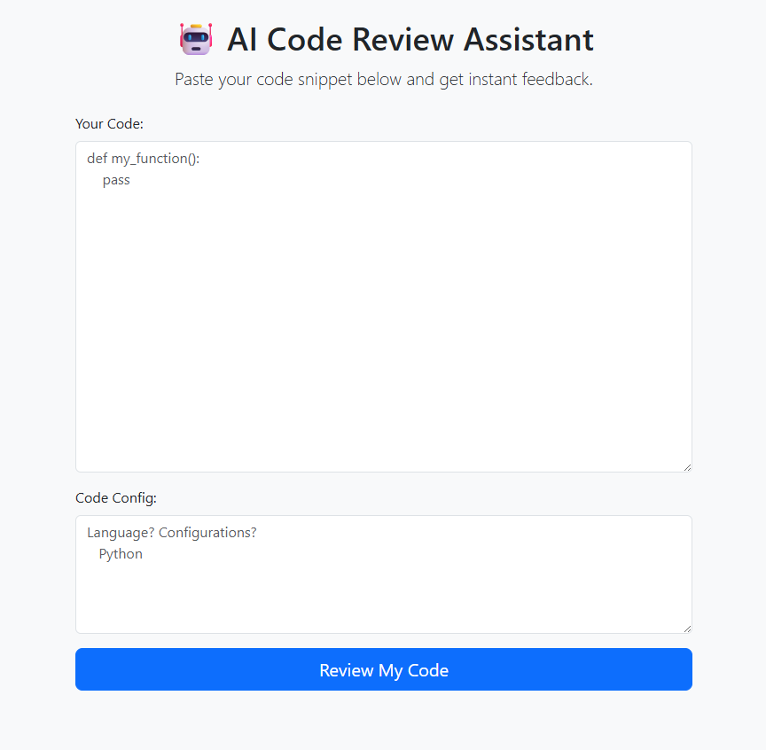

# 🤖 AI Code Review Assistant

A simple web application that uses Google's Gemini API to provide an expert-level review of your code snippets. Paste your code, get instant feedback on bugs, style, and potential improvements.



---

## ✨ Features

* **AI-Powered Feedback:** Leverages the power of Google's Gemini Pro model to provide insightful code analysis.
* **Simple Web Interface:** A clean and intuitive UI built with Flask and Bootstrap for easy use.
* **Markdown Formatting:** The AI's feedback is rendered in clean, readable Markdown format.
* **Secure API Key Handling:** Uses environment variables to keep your Google API key safe and private.

---

## 🛠️ Tech Stack

* **Backend:** Python, Flask
* **AI Model:** Google Gemini Pro API (`google-generativeai`)
* **Frontend:** HTML, Bootstrap 5

---

## 🚀 Getting Started

Follow these instructions to get a local copy up and running.

### Prerequisites

* Python 3.8+
* A Google Gemini API Key. You can get one from [Google AI Studio](https://aistudio.google.com/).

### Installation & Setup

1.  **Clone the repository:**
    ```sh
    git clone [https://github.com/your-username/your-repo-name.git](https://github.com/your-username/your-repo-name.git)
    cd your-repo-name
    ```

2.  **Create and activate a virtual environment:**
    * **macOS/Linux:**
        ```sh
        python3 -m venv venv
        source venv/bin/activate
        ```
    * **Windows:**
        ```sh
        python -m venv venv
        venv\Scripts\activate
        ```

3.  **Install the required dependencies:**
    ```sh
    pip install -r requirements.txt
    ```

4.  **Set up your environment variables:**
    Create a `.env` file in the root of the project and add your API key:
    ```
    GOOGLE_API_KEY="PASTE_YOUR_API_KEY_HERE"
    ```
    *(Note: This project is configured to read the key from system environment variables. For local development, you can add `python-dotenv` to your `requirements.txt` and load it in `main.py`)*

    Alternatively, set it in your terminal for the current session:
    * **macOS/Linux:** `export GOOGLE_API_KEY="YOUR_API_KEY"`
    * **Windows (CMD):** `set GOOGLE_API_KEY="YOUR_API_KEY"`

### Running the Application

With your environment activated and API key set, run the Flask development server:

```sh
python main.py
```

Open your web browser and navigate to `http://127.0.0.1:5000` to see the application in action!

---

## Usage

1.  Navigate to the home page.
2.  Paste a code snippet into the text area.
3.  Click the **"Review My Code"** button.
4.  View the detailed feedback on the results page.